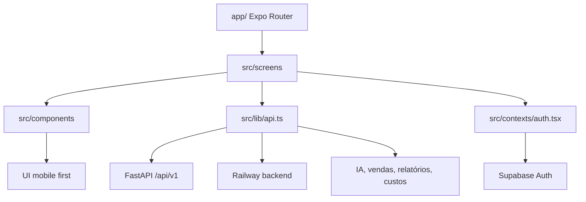
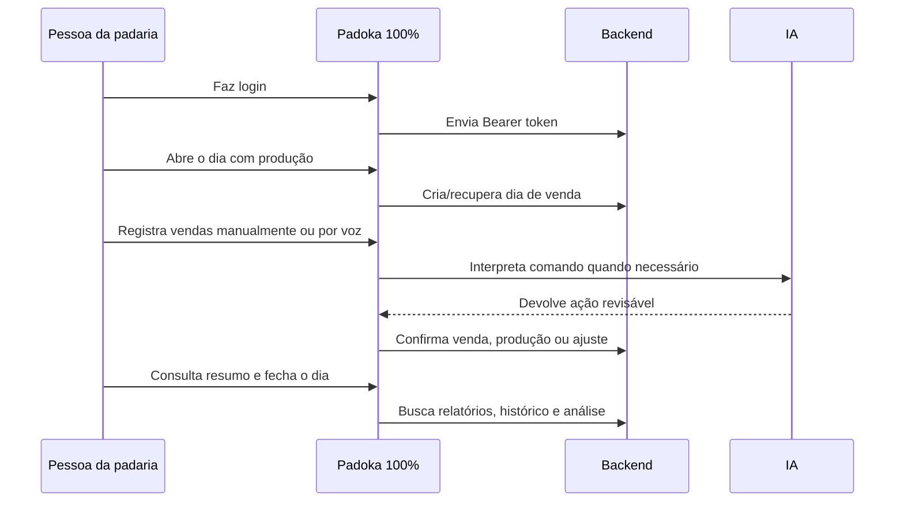

<p align="center">
  
</p>

<h1 align="center">PADOKA 100%</h1>

<p align="center">
  <strong>O cockpit mobile da padaria moderna.</strong><br />
  Venda, produção, catálogo, resumo financeiro, IA operacional e controle de custos em uma experiência feita para o balcão.
</p>

<p align="center">
  
  
  
  
  
</p>

<p align="center">
  <a href="#visao-geral">Visão geral</a>
  ·
  <a href="#experiencia-do-app">Experiência</a>
  ·
  <a href="#arquitetura">Arquitetura</a>
  ·
  <a href="#rodar-localmente">Rodar</a>
  ·
  <a href="#builds">Builds</a>
</p>

---

<a id="visao-geral"></a>

## Visão Geral

**Padoka 100%** é um app mobile Expo para transformar a rotina de uma pequena padaria em uma operação simples, visual e poderosa.

Ele nasce para resolver o básico com muita velocidade: abrir o dia, produzir, vender, acompanhar sobras, fechar o caixa e entender o resultado. A camada mais tecnológica entra sem atrapalhar: IA para interpretar comandos, vendas por voz, análises do período, custeio assistido e evolução para decisões mais inteligentes.

> Menos planilha perdida. Mais venda registrada. Mais clareza no fim do dia.

---

<a id="experiencia-do-app"></a>

## Experiência Do App

| Área | O que entrega |
| --- | --- |
| **Venda** | Dia aberto, produtos do dia, carrinho, registro manual, venda por texto, venda por áudio e fechamento do dia. |
| **Catálogo** | Produtos ativos, cadastro, edição, preços, fotos e separação clara entre catálogo completo e venda do dia. |
| **Resumo** | Faturamento por período, gráfico, histórico, calendário, resumo por data e análise com IA. |
| **Perfil** | Login, conta, dados pessoais, foto, plano de acesso, sessão e conexão com backend. |
| **Custos** | Cliente pronto para assistente de custeio, receitas, insumos, custos adicionais e lista de compras. |
| **IA Operacional** | Interpretação de comandos, transcrição de áudio, importação por foto e confirmação antes de executar. |

---

## Stack Nuclear

```txt
Mobile          Expo SDK 54 + React Native 0.81.5
Linguagem       TypeScript strict
Rotas           Expo Router
Dados remotos   TanStack Query + fetch wrapper próprio
Auth            Supabase Auth + Bearer token
Sessão          expo-secure-store + contexto React
UI              Componentes próprios + lucide-react-native
Mídia           expo-image-picker + expo-image
Áudio           expo-audio
Build mobile    EAS Build + Expo Updates
Build web       Expo export + Railway
Backend         FastAPI no Railway
```

---

<a id="arquitetura"></a>

## Arquitetura



```txt
app/                  rotas, tabs e entrypoints do Expo Router
src/screens/          telas principais do produto
src/components/       UI base, calendário, agente, notificações e módulos por área
src/contexts/         autenticação e sessão
src/lib/              API, tema, perfil, planos, sessão, formatação e settings
src/types/            contratos TypeScript da API
src/utils/            datas, eventos, mídia, texto e saudação
docs/                 decisões, pendências de backend e direção visual
```

---

## Fluxo De Operação



---

<a id="rodar-localmente"></a>

## Rodar Localmente

Instale as dependências:

```bash
npm install
```

Ajuste dependências nativas do Expo, quando necessário:

```bash
npx expo install --fix
```

Inicie o app:

```bash
npm run start
```

Depois escaneie o QR Code com o **Expo Go** no Android ou iOS.

---

## Ambiente

Crie o arquivo de ambiente a partir do exemplo:

```bash
cp .env.example .env
```

Variáveis esperadas:

```txt
EXPO_PUBLIC_SUPABASE_URL=
EXPO_PUBLIC_SUPABASE_ANON_KEY=
```

O app também lê valores de `app.json` em `expo.extra`.

Backend padrão:

```txt
Produção   https://padoka100-production.up.railway.app
Local      http://localhost:8000
```

Em celular físico, `localhost` aponta para o próprio aparelho. Para usar backend local no celular, troque `expo.extra.apiLocalUrl` em `app.json` pelo IP da sua máquina:

```json
{
  "apiLocalUrl": "http://192.168.0.10:8000"
}
```

---

## Scripts

| Comando | Ação |
| --- | --- |
| `npm run start` | Abre o Expo Dev Server. |
| `npm run android` | Inicia no Android. |
| `npm run ios` | Inicia no iOS. |
| `npm run web` | Inicia no navegador. |
| `npm run build` | Alias compatível com o build automático do Railway. |
| `npm run build:web` | Gera a versão web de produção em `dist`. |
| `npm run start:web` | Serve a versão web usando a porta do ambiente. |
| `npm run start:mobile` | Inicia explicitamente o servidor do Expo mobile. |
| `npm run typecheck` | Valida TypeScript sem emitir build. |
| `npm run lint` | Executa ESLint. |
| `npm run doctor` | Roda diagnóstico do Expo. |
| `npm run update:preview` | Publica update EAS no canal preview. |
| `npm run update:production` | Publica update EAS no canal production. |

---

<a id="builds"></a>

## Builds

Preview Android:

```bash
eas build -p android --profile preview
```

Preview iOS:

```bash
eas build -p ios --profile preview
```

Produção:

```bash
eas build -p android --profile production
eas build -p ios --profile production
```

Para iOS é necessário ter uma Apple Developer Account. O primeiro build de cada plataforma deve ser feito em modo interativo para o EAS gerar e salvar as credenciais.

```bash
npm install -g eas-cli
eas login
eas build -p ios --profile production
```

Para testar no **Expo Go**, não precisa gerar build: rode `npm run start` e escaneie o QR Code.

### Web no Railway

O mesmo código também gera a aplicação web atual, sem alterar os builds móveis:

```bash
npm run build:web
npm run start:web
```

O `railway.json` executa esses comandos no serviço `padoka100-web`. Os aliases
`npm run build` e `npm start` também reconhecem o Railway, o que mantém compatibilidade
com configurações antigas do serviço. Fora do Railway, `npm start` continua iniciando o
Expo mobile normalmente. O servidor entrega
as rotas do Expo Router como SPA, responde em `/health` e usa a porta fornecida pelo
Railway. O arquivo `public/sw.js` remove o antigo PWA Vite e seus caches quando um
navegador que ainda guarda a primeira versão voltar ao endereço.

Produção web:

```txt
https://padoka100-web-production.up.railway.app
```

---

## Backend E Integrações

O app conversa com o backend em `/api/v1` usando:

| Integração | Status no app |
| --- | --- |
| Auth e perfil | Integrado. |
| Produtos, preços, locais e mídia | Integrado. |
| Dia de venda, produção e fechamento | Integrado. |
| Vendas e cancelamento | Integrado. |
| Relatórios e histórico | Integrado. |
| IA para comandos, áudio, foto e análise | Cliente integrado. |
| Custos, receitas, insumos e compras | Cliente pronto; UI em evolução. |
| Notificações | Cliente com fallback para backend ainda não publicado. |

Notas importantes ficam em [`docs/BACKEND-TODO.md`](docs/BACKEND-TODO.md).

---

## Segurança E Acesso

- O app exige sessão autenticada antes de liberar telas operacionais.
- A sessão vem do Supabase Auth.
- Requisições autenticadas usam `Authorization: Bearer`.
- `X-API-Key` continua como compatibilidade operacional quando não existe sessão.
- O frontend respeita capacidades do usuário, mas a autorização final fica no backend.
- Planos e capacidades estão documentados em [`docs/ACCESS_PLANS.md`](docs/ACCESS_PLANS.md).

---

## Direção Visual

O produto deve parecer uma ferramenta de uso diário para padaria, não um dashboard corporativo frio.

```txt
Mobile first
Toques grandes
Texto legível
Português humano
Hierarquia óbvia
Cores quentes de padaria
Feedbacks claros
IA como assistente, não como complicação
```

A referência viva está em [`docs/visual-direction.md`](docs/visual-direction.md).

---

## Roadmap Turbinado

| Fase | Próxima conquista |
| --- | --- |
| **Operação** | Refinar abertura do dia, sobras, esgotados e correções retroativas. |
| **Inteligência** | Melhorar análises por período, perguntas específicas e leitura de padrões. |
| **Custos** | Construir experiência guiada para receitas, insumos, margem e lista de compras. |
| **Gestão** | Tela para papéis, usuários, capacidades e planos. |
| **Mídia + IA** | Foto de nota fiscal, OCR e confirmação assistida. |
| **Performance** | Reduzir chamadas, cachear melhor e lapidar estados vazios/offline. |

---

## Checklist De Qualidade

Antes de mandar uma alteração:

```bash
npm run typecheck
npm run lint
npm run doctor
```

Para mudanças visuais, validar no Expo Go em tela pequena e grande.

---

## Manifesto

**Padoka 100%** é para a pessoa que precisa vender agora, entender depois e melhorar amanhã.

É tecnologia com cheiro de fornada: rápida, direta, bonita e útil.

<p align="center">
  <strong>PADOKA 100% // vender. medir. aprender. crescer.</strong>
</p>
